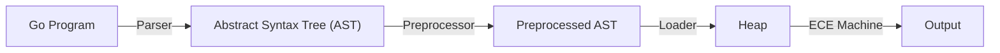

# CS4215 Project Report

**Title**: Explicit-control evaluator (ECE) for Go

**Team Members**: Rama Aryasuta Pangestu (student number to be inserted), Yeung Man Tsung (A0255829N)

**Repository URL**: [https://github.com/benson1029/go-slang](https://github.com/benson1029/go-slang)

**Live Demo**: [https://benson1029.github.io/go-slang/](https://benson1029.github.io/go-slang/)

This report can be viewed online on [https://benson1029.github.io/go-slang/docs/project-report/report](https://benson1029.github.io/go-slang/docs/project-report/report).

## Table of Contents

- [Language Processing Steps](#language-processing-steps)
- [Objectives](#objectives)
    - [Language Features](#language-features)
    - [Specification of One Baseline Objective](#specification-of-one-baseline-objective)
    - [Met and Unmet Objectives](#met-and-unmet-objectives)
- [Project Source](#project-source)
- [Test Cases](#test-cases)

## Language Processing Steps

Externally, this ECE machine is an interpreter for Go written in JavaScript, which is then run in a JavaScript interpreter (the browser). This is shown using the following T-diagram:


Internally, the Go program is first parsed into an abstract syntax tree (AST) using a parser, generated with peg.js using our own syntax definition. The AST is then preprocessed by a preprocessor, which annotates the global scope declarations with their necessary captures and then sorts the global scope declarations such that their dependencies are satisified. The preprocessed AST is then passed to a loader, which loads the entire program into the heap and initializing the Control stack in the ECE machine. The ECE machine then executes the instructions in the Control stack.



## Objectives

### Language Features

TODO

### Specification of One Baseline Objective

TODO

### Met and Unmet Objectives

TODO


## Project Source

Our project source code is available on GitHub at [benson1029/go-slang](https://github.com/benson1029/go-slang). It is a standalone React application that can be run locally, or deployed to GitHub Pages on [https://benson1029.github.io/go-slang/](https://benson1029.github.io/go-slang/).

To run the project locally, you need to have Node.js and npm installed. After that, you can run the application locally by running the following commands:

```bash
git clone https://github.com/benson1029/go-slang.git
cd go-slang
npm install
npm start
```

Then, open [http://localhost:3000](http://localhost:3000) to view it in your browser.

## Test Cases

Unit tests for the parser and preprocessor (specially, the module for sorting global declarations) are available in [`src/go/parser/go.test.js`](https://github.com/benson1029/go-slang/blob/main/src/go/parser/go.test.js) and [`src/go/ece/loader/globalSort.test.ts`](https://github.com/benson1029/go-slang/blob/main/src/go/ece/loader/globalSort.test.ts). Integration tests for the ECE machine are available under the directory [`src/go/ece/tests`](https://github.com/benson1029/go-slang/tree/main/src/go/ece/tests), which cover all language constructs that are supported by the ECE machine.

For most test cases that does not involve recursive calls, we additionally check whether all objects in the heap are freed after the program execution. This confirms that our reference counting garbage collector is working correctly. Recursive calls will create cyclic data structures in the heap, thus we do not check for unfreed objects in these cases.

The purpose of each test is documented in the source code.

To run the tests, you can run the following command:

```bash
npm test
```
